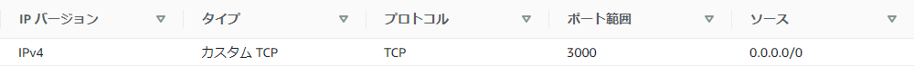

# EC2 (環境構築・サンプルアプリケーションのデプロイ/起動

<br><br>
( ※以下手順は、`/home/ec2-user` 配下にサンプルアプリケーションをクローン・配置して実施 )<br>

1. [EC2へログイン / ログイン後の実施事項](#1-ec2へログイン--ログイン後の実施事項)
1. [各種インストール](#2-各種インストール)
1. [Railsアプリケーション (クローン・インストール・各種設定)](#3-railsアプリケーション-クローンインストール各種設定)
1. [AWS (EC2のセキュリティグループ設定)](#4-aws-ec2のセキュリティグループ設定)
1. [Railsアプリケーション (起動前実施事項：アセットコンパイル)](#5-railsアプリケーション-起動前実施事項アセットコンパイル)
1. [Railsアプリケーション (起動：組込サーバ (Puma) )](#6-railsアプリケーション-起動組込サーバ-puma-)<br>

| 動作環境 | バージョン | 
| -------- | ---------- |  
| Ruby     | 3.1.2      |  
| Bundler  | 2.3.14     |  
| Rails    | 7.0.4      |  
| Node     | v17.9.1    |  
| Yarn     | 1.22.19    | <br>

<br><br>
## 1. EC2へログイン / ログイン後の実施事項
■ EC2を起動・SSH接続後、`/home/ec2-user` にて以降の手順を実施。
- 現在いるディレクトリの場所を確認
 ```
 # /home/ec2-user と表示されることを確認
 $ pwd
 ```
<details><summary>swap作成 ( ※EC2のメモリ不足を補うため、必要に応じて実施 )</summary>
   
```
# メモリ使用状況確認
$ free -m
 
# スワップ作成状況確認 ( 下記表示(未作成)を確認 )
$ grep Swap /proc/meminfo
-------------------------------
SwapCached:            0 kB
SwapTotal:             0 kB
SwapFree:              0 kB
-------------------------------

# 512MBのスワップファイルを作成
$ sudo dd if=/dev/zero of=/swapfile bs=1M count=512
 
# スワップファイルの読み書きのアクセス許可
$ sudo chmod 600 /swapfile

# Linuxスワップ領域のセットアップ ( 下記表示を確認 )
$ sudo mkswap /swapfile
-------------------------------
スワップ空間バージョン 1 を設定します。サイズ = 512 MiB (536866816 バイト)
ラベルはありません, UUID=×××
-------------------------------
 
# スワップ領域にスワップファイルを追加
$ sudo swapon /swapfile
 
# 正常に完了したことを確認
$ sudo swapon -s
-------------------------------
ファイル名             タイプ       サイズ   使用済み    優先順位
/swapfile                               file        524284  0   -2
-------------------------------

# ファイルの末尾に新しい行(下記)を追加 ( 下記のコードを追記 )
$ sudo vi /etc/fstab
-------------------------------
/swapfile swap swap defaults 0 0
-------------------------------

# スワップ作成状況確認 ( 下記表示を確認 )
$ grep Swap /proc/meminfo
-------------------------------
SwapCached:            0 kB
SwapTotal:        524284 kB
SwapFree:         524284 kB
-------------------------------
 
# メモリ使用状況確認
$ free -m
```   
</details>


<br><br>
■ パッケージのアップデート
```
$ sudo yum -y update
```

<br><br>
## 2. 各種インストール
■ Railsアプリに必要なパッケージをインストール
```
$ sudo yum -y install gcc-c++ make patch git curl zlib-devel openssl-devel ImageMagick-devel readline-devel libcurl-devel libffi-devel libicu-devel libxml2-devel libxslt-devel
```
   
<br><br>
■ rbenvのインストール
```
$ git clone https://github.com/sstephenson/rbenv.git ~/.rbenv
```
- .bash_profileの設定　( ※ログインする度にrbenvに必要な設定を読み込ませる設定 )
```
$ echo 'export PATH="$HOME/.rbenv/bin:$PATH"' >> ~/.bash_profile
$ echo 'eval "$(rbenv init -)"' >> ~/.bash_profile
$ source .bash_profile
```
   
<br><br>
■ ruby-buildのインストール
```
$ git clone https://github.com/sstephenson/ruby-build.git ~/.rbenv/plugins/ruby-build
```
   
<br><br>
■ Rubyをインストール　( ※rbenvを使用：バージョンは `3.1.2` )<br>
  　( 補足：※インストールにしばらく時間がかかる )
```
$ rbenv install 3.1.2

# Rubyを使用可能とするコマンドを実行
$ rbenv global 3.1.2
$ rbenv rehash

# Rubyのバージョン確認
$ ruby -v
```
   
<br><br>
■ Railsをインストール　( ※バージョンは `7.0.4` )
```
$ gem install rails -v 7.0.4

# Railsのバージョン確認
$ rails -v
```

<br><br>
■ Node.jsをインストール　( バージョンは `17.9.1` )<br>
  　( ※nvmを使用：最新バージョンは [nvm-sh/nvm - GitHub](https://github.com/nvm-sh/nvm) を参照 )
```
$ curl -o- https://raw.githubusercontent.com/nvm-sh/nvm/v0.39.3/install.sh | bash
$ source .bash_profile
$ nvm install 17.9.1

# Node.jsのバージョン確認
$ node -v
```

<br><br>
■ yarnをインストール
```  
$ npm install --global yarn

# インストール確認
$ yarn -v
```
   
<br><br>
■ MySQLをインストール<br>
- MariaDBをアンインストール<br>
( ※Amazon Linux2 にインストールされているMariaDBを削除 )<br>
( 補足：MariaDBの削除は、後にインストールするMySQLと干渉することがあるため実行 )
```
$ sudo yum -y remove mariadb-libs

# 削除されたことを確認 (何も表示されないことを確認)
$ yum list installed | grep mariadb
```
- MySQLインストール / 起動
```
$ sudo yum localinstall -y https://dev.mysql.com/get/mysql80-community-release-el7-7.noarch.rpm
$ sudo yum install -y mysql-community-server mysql-community-devel

# インストール確認
$ yum list installed | grep mysql

# MySQLのバージョン確認
$ mysql --version

# MySQLの起動・確認
$ sudo service mysqld start && sudo service mysqld status

# 自動起動の確認 (※有効化していなければ `sudo systemctl enable mysqld` を実行)
$ sudo systemctl is-enabled mysqld
```   

<br><br>
## 3. Railsアプリケーション (クローン・インストール・各種設定)
■ サンプルアプリケーションのクローン
```
$ git clone https://github.com/yuta-ushijima/raisetech-live8-sample-app.git
```
   
<br><br>
■ `raisetech-live8-sample-app` ディレクトリに移動し以降の手順を実施
```
$ cd raisetech-live8-sample-app

# /home/ec2-userraisetech-live8-sample-app と表示されることを確認
$ pwd
```
   
<br><br>
■ Bundlerのインストール　( ※バージョンは `2.3.14` )
```
$ gem install bundler:2.3.14

# Bundlerのバージョン確認
$ bundler -v
```

<br><br>
■ Bundlerを使用してGemfile記載のライブラリ群を一括インストール
```
$ bundle install 
```
   
<br><br>
■ 念のため、サンプルアプリケーション動作環境(インストールしたもの)のバージョンを確認
```
$ ruby -v && bundle -v && rails -v && node -v && yarn -v
```
| 動作環境 | バージョン |  
| -------- | ---------- |  
| Ruby     | 3.1.2      |  
| Bundler  | 2.3.14     |  
| Rails    | 7.0.4      |  
| Node     | v17.9.1    |  
| Yarn     | 1.22.19    | 


<br><br>
■ database.yml を編集
- `/config/database.yml.sample`　をコピー、`database.yml` にリネームして下記〇〇〇の箇所を追記/編集。
```
default: &default
  adapter: mysql2
  encoding: utf8mb4
  pool: <%= ENV.fetch("RAILS_MAX_THREADS") { 5 } %>
  username: 〇〇〇 (=※RDS作成時に設定したユーザー名)
  password: 〇〇〇　(=※〃 に設定したパスワード)
  host: 〇〇〇　(=※RDSのエンドポイント)
```
( 補足：各パラメータの概要 )
```
　adapter:   接続するDBの種類
　encoding:  文字コード
　reconnect: 再接続するかどうか
　database:  DB名
　pool:      確保する接続プール
　username:  ユーザー名
　password:  パスワード
　host:      ホスト名
```
- `development:` と `test:` の `socket: /tmp/mysql.sock` 箇所を、`socket: /var/lib/mysql/mysql.sock`　に変更。
```
development:
  <<: *default
  database: raisetech_live8_sample_app_development
  #socket: /tmp/mysql.sock　　# デフォルトの記述
  socket: /var/lib/mysql/mysql.sock　　# 左記に変更
----------------------------------------------------
test:
  <<: *default
  database: raisetech_live8_sample_app_test
  #socket: /tmp/mysql.sock　　# デフォルトの記述
  socket: /var/lib/mysql/mysql.sock　　# 左記に変更
```
( 補足：上記パス `/var/lib/mysql/mysql.sock` は設定ファイル `/etc/my.cnf` 、もしくはコマンド `mysql_config --socket` で確認可能 )

<br><br>
■ MySQLに データベース / テーブル を作成
```
# DB(MySQL)にデータベースを作成
$ bundle exec rails db:create

# DB(MySQL)にテーブルを作成
$ bundle exec rails db:migrate
```
  
<br><br>
## 4. AWS (EC2のセキュリティグループ設定)
■ EC2のセキュリティグループ(インバウンド)を編集 ： `3000番ポート`の許可設定 ( ※下図参照 )<br>

    
<br><br>
## 5. Railsアプリケーション (起動前実施事項：アセットコンパイル)
■ アセットコンパイル<br>
　( ※プリコンパイル (手動コンパイル) ：下記コマンドは、アセットの圧縮等を実施して一つのファイルにまとめている )
```
$ rails assets:precompile
```
( 実行後、`/home/ec2-user/raisetech-live8-sample-app/public/assets` フォルダ配下に各種ファイルが作成されることを確認 )
   
<br><br>
## 6. Railsアプリケーション (起動：組込サーバ (Puma) )
■ Railsの組込サーバ (Puma) を起動
```
$ rails s -b 0.0.0.0
```
