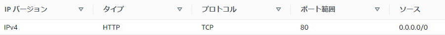
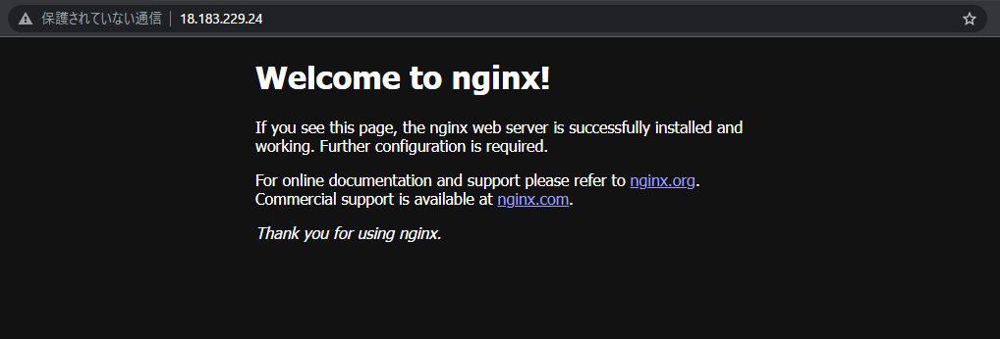
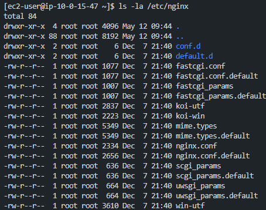
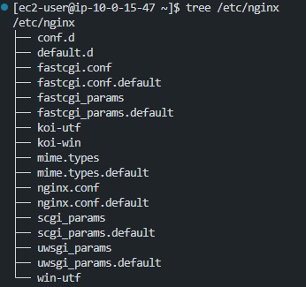
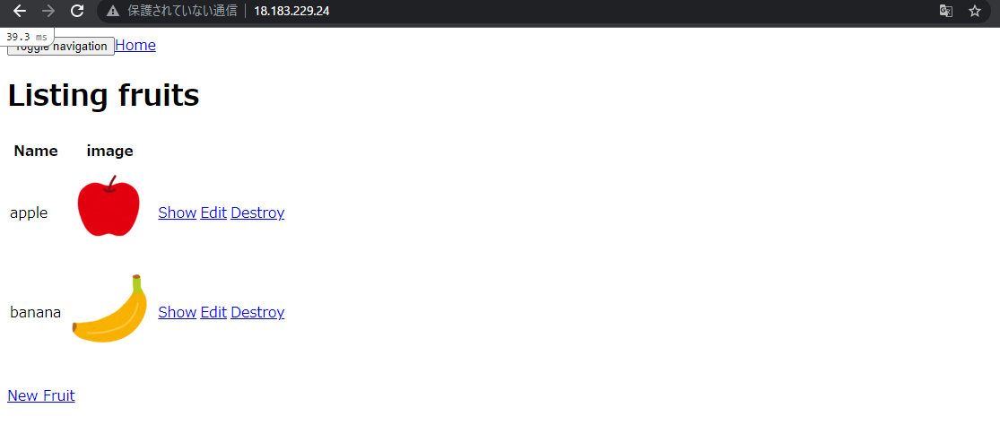
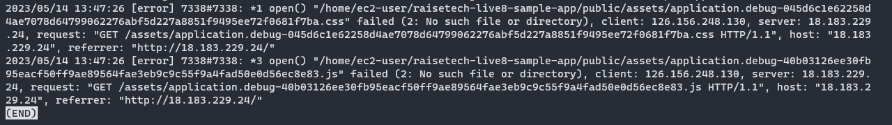
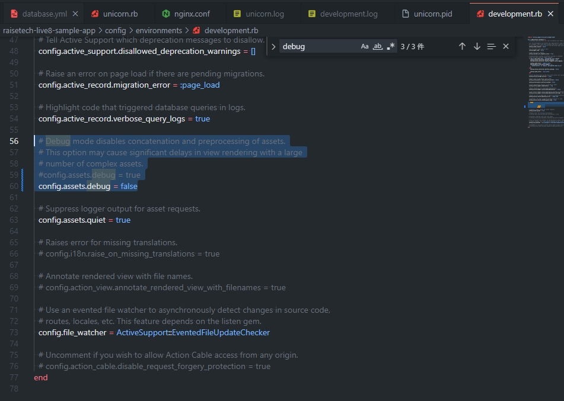
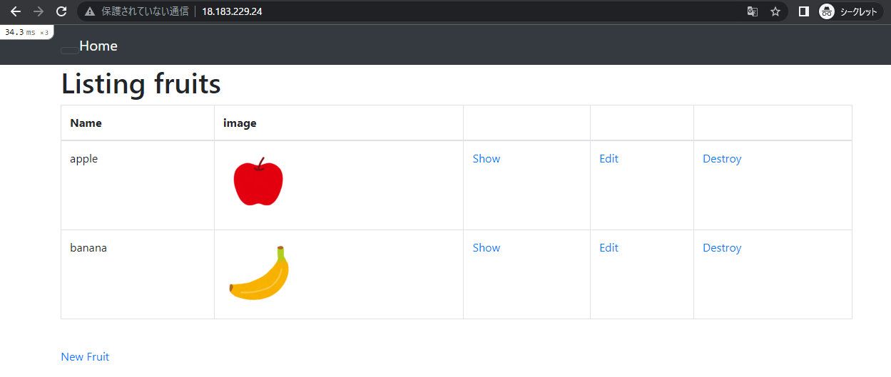

# Webサーバ (Nginx) / APサーバ (Unicorn) の構築・設定<br>
1. [Unicornのインストール・各種設定・動作確認](#1-unicornのインストール各種設定動作確認)
1. [Nginxのインストール・各種設定・動作確認](#2-nginxのインストール各種設定動作確認)
1. [エラー対処 (表示くずれ)](#3-エラー対処-表示くずれ)<br><br>


## 1.  Unicornのインストール・各種設定・動作確認
■ インストール / 起動設定・確認
- Unicornをインストール 　( ※今回はGemfileに `gem 'unicorn'` と記述があり、EC2の環境構築時に `bandle install` でインストール済 )
- インストールされているか確認
```
$ gem list | grep unicorn
```

<br><br>
■ Unicornの設定ファイル作成/編集
- `/raisetech-live8-sample-app/config/` 配下に `unicorn.rb` を作成/編集　( ※今回は事前に作成されているためそちらを使用 )<br>

\--------------------------------------------------------------------------------------------------------------<br>
【 補足：Nginxとの接続(ソケット通信) 設定について 】<br>
- `unicorn.rb` 内の ( 5行目：`/home/ec2-user/raisetech-live8-sample-app/unicorn.sock` ) を<br>
   Nginxの設定ファイル `/etc/nginx/conf.d/raisetech-live8-sample-app.conf` 、もしくは<br>
   `/etc/nginx/nginx.conf` の `upstream ○○ {}` 内に記載　  ( ※後のNginxの設定手順を参照 )<br>

\--------------------------------------------------------------------------------------------------------------<br>
	
<br><br>
■ Unicornの起動
- 起動 / 起動確認
```
# サンプルアプリケーション(raisetech-live8-sample-app)のディレクトリ内へ移動
$ cd /home/ec2-user/raisetech-live8-sample-app

# 開発環境/バックグラウンドで起動
$ bundle exec unicorn_rails -c config/unicorn.rb -E development -D

# プロセス確認で起動確認 (※unicorn_rails master,worker が稼働していることを確認)
$ ps aux | grep unicorn

# /home/ec2-user/raisetech-live8-sample-app 配下に unicorn.pid,unicorn.sock が生成されていることを確認
$ ls
```
<details><summary>【 補足：Unicornを再起動させたい場合 】</summary>
   
```
# unicorn_rails master のPID を確認
$ ps aux | grep unicorn

# Unicornを停止
$ kill <masterのPID>

# 開発環境/バックグラウンドで起動
$ bundle exec unicorn_rails -c config/unicorn.rb -E development -D
```
</details>

	
<br><br>
## 2. Nginxのインストール・各種設定・動作確認
■ インストール / 起動設定・確認
```
$ sudo amazon-linux-extras install -y nginx1
$ nginx -v　　#バージョン確認

# Nginxの起動･確認
$ sudo systemctl start nginx && sudo systemctl status nginx
	
# Nginxの自動起動・確認
$ sudo systemctl enable nginx && sudo systemctl is-enabled nginx
```

<br><br>
■ ブラウザでの動作確認
- EC2のセキュリティグループ(インバウンド)の設定追加 ( 下図参照 ) ： `HTTP (ポート80番)` <br>
( ※Nginxはデフォルトで80番ポートで待受設定されているため、該当ポートの許可設定を実施 )<br>
<br><br>
- ブラウザにて接続確認 `HTTP (ポート80番)`
<br>

■ Nginxの設定ファイル作成/編集<br>
\--------------------------------------------------------------------------------------------------------------<br>
<details><summary>パターン① 　(  /etc/nginx/conf.d  内に新規設定ファイル ( ○○.conf ) を作成する場合 )</summary>
	
<br><br>
- Nginxの設定ファイルが格納されているディレクトリを確認
```
$ ls -la /etc/nginx
$ tree /etc/nginx　　# ※treeコマンドを使用するには別途インストールが必要
```


	
<br><br>
 - ディレクトリ `/etc/nginx/conf.d` 内に、今回のサンプルアプリケーション用の新規設定ファイルを作成/編集<br>
( ※設定ファイル `/etc/nginx/nginx.conf` 内に、 `/etc/nginx/conf.d` 以下を読み込む設定が記述されているため新規設定ファイルを作成 )
```
# 今回は raisetech-live8-sample-app.conf というファイル名で新規作成
$ sudo vim /etc/nginx/conf.d/raisetech-live8-sample-app.conf
```
- 設定ファイルに以下を記述
```
upstream unicorn {    # upstream ○○：○○は任意のアプリケーション名 ( ※デフォルトはunicorn、パターン①ではデフォルトの名称を使用 )
  # Unicornと連携させるための設定 
  # ( ※今回は同じEC2内でソケット通信をするため下記を記述：/raisetech-live8-sample-app/config/unicorn.rb 内の unicorn.sock を指定 )
  server unix:/home/ec2-user/raisetech-live8-sample-app/unicorn.sock;
}

# サーバの設定
server {
  # 接続を受け付けるポート番号
  listen 80;
  # 接続を受け付けるリクエストURL ( ※下記URL以外ではアクセス不可 )
  server_name < EC2のEIP or パブリックIP >;
  # 接続が来た際のrootディレクトリ ( ※アプリケーションの /public を指定)
  root /home/ec2-user/raisetech-live8-sample-app/public;

   # アップロードファイル容量の上限を2GBに設定。(※デフォルトは1MB)
  client_max_body_size 2g;

  # assetsファイル ( CSSやJavaScriptのファイルなど ) にアクセスが来た際に適用される設定
  location ^~ /assets/ {
    gzip_static on;
    expires max;
    add_header Cache-Control public;
  }

  location @unicorn {
    proxy_set_header X-Forwarded-For $proxy_add_x_forwarded_for;
    proxy_set_header Host $http_host;
    proxy_redirect off;
    proxy_pass http://unicorn;
  }

  try_files $uri/index.html $uri @unicorn;
  error_page 500 502 503 504 /500.html;
}
```
	
<br><br>
- 権限関連対応 ( Nginxの実行ユーザー と Unicornの実行ユーザー を合わせる設定 )<br>
( ※下記対応しなければ `permission denined` エラーが発生し、Nginxの起動ができない )
```
$ sudo vim /etc/nginx/nginx.conf
```
- 設定ファイルに以下を記述<br>
( `/etc/nginx/nginx.conf` の `user nginx;` を `user ec2-user;` に変更 ( ※その他の項目はデフォルト ) )
```
# For more information on configuration, see:
#   * Official English Documentation: http://nginx.org/en/docs/
#   * Official Russian Documentation: http://nginx.org/ru/docs/

#user nginx;　　# 左記を ec2-user に変更 (※直下に記述)
user ec2-user;
worker_processes auto;
error_log /var/log/nginx/error.log;
pid /run/nginx.pid;

# Load dynamic modules. See /usr/share/doc/nginx/README.dynamic.
include /usr/share/nginx/modules/*.conf;

events {
    worker_connections 1024;
}

http {
    log_format  main  '$remote_addr - $remote_user [$time_local] "$request" '
                      '$status $body_bytes_sent "$http_referer" '
                      '"$http_user_agent" "$http_x_forwarded_for"';

    access_log  /var/log/nginx/access.log  main;

    sendfile            on;
    tcp_nopush          on;
    tcp_nodelay         on;
    keepalive_timeout   65;
    types_hash_max_size 4096;

    include             /etc/nginx/mime.types;
    default_type        application/octet-stream;

    # Load modular configuration files from the /etc/nginx/conf.d directory.
    # See http://nginx.org/en/docs/ngx_core_module.html#include
    # for more information.
    include /etc/nginx/conf.d/*.conf;

    server {
        listen       80;
        listen       [::]:80;
        server_name  _;
        root         /usr/share/nginx/html;

        # Load configuration files for the default server block.
        include /etc/nginx/default.d/*.conf;

        error_page 404 /404.html;
        location = /404.html {
        }

        error_page 500 502 503 504 /50x.html;
        location = /50x.html {
        }
    }

# Settings for a TLS enabled server.
#
#    server {
#        listen       443 ssl http2;
#        listen       [::]:443 ssl http2;
#        server_name  _;
#        root         /usr/share/nginx/html;
#
#        ssl_certificate "/etc/pki/nginx/server.crt";
#        ssl_certificate_key "/etc/pki/nginx/private/server.key";
#        ssl_session_cache shared:SSL:1m;
#        ssl_session_timeout  10m;
#        ssl_ciphers PROFILE=SYSTEM;
#        ssl_prefer_server_ciphers on;
#
#        # Load configuration files for the default server block.
#        include /etc/nginx/default.d/*.conf;
#
#        error_page 404 /404.html;
#            location = /40x.html {
#        }
#
#        error_page 500 502 503 504 /50x.html;
#            location = /50x.html {
#        }
#    }

}
```
</details>
	
	
\--------------------------------------------------------------------------------------------------------------<br>
<details><summary>パターン② 　(  /etc/nginx/nginx.conf  の内容を追記/変更する場合 )</summary>
	
<br><br>
- Nginxの設定ファイルが格納されているディレクトリを確認
```
$ ls -la /etc/nginx
$ tree /etc/nginx　　# ※treeコマンドを使用するには別途インストールが必要
```


	
	
	
<br><br>
- `/etc/nginx/nginx.conf` を編集
```	
$ sudo vim /etc/nginx/nginx.conf
```	
- 設定ファイルに以下を記述
```
# For more information on configuration, see:
#   * Official English Documentation: http://nginx.org/en/docs/
#   * Official Russian Documentation: http://nginx.org/ru/docs/

#user nginx;  # 左記を ec2-user に変更 (※直下に記述)
user ec2-user;
worker_processes auto;
error_log /var/log/nginx/error.log;
pid /run/nginx.pid;

# Load dynamic modules. See /usr/share/doc/nginx/README.dynamic.
include /usr/share/nginx/modules/*.conf;

events {
    worker_connections 1024;
}

http {
    log_format  main  '$remote_addr - $remote_user [$time_local] "$request" '
                      '$status $body_bytes_sent "$http_referer" '
                      '"$http_user_agent" "$http_x_forwarded_for"';

    access_log  /var/log/nginx/access.log  main;

    sendfile            on;
    tcp_nopush          on;
    tcp_nodelay         on;
    keepalive_timeout   65;
    types_hash_max_size 4096;

    include             /etc/nginx/mime.types;
    default_type        application/octet-stream;

    # Load modular configuration files from the /etc/nginx/conf.d directory.
    # See http://nginx.org/en/docs/ngx_core_module.html#include
    # for more information.

    # 下記を読み込まないようにコメントアウト
    # include /etc/nginx/conf.d/*.conf;

    upstream raisetech-live8-sample-app {    # upstream ○○：○○は任意のアプリケーション名 ( ※デフォルトはunicorn、パターン②では名称を変更 )
      # Unicornと連携させるための設定を追加
      # ( ※今回は同じEC2内でソケット通信をするため下記を記述：/raisetech-live8-sample-app/config/unicorn.rb内のunicorn.sockを指定 )
      server unix:/home/ec2-user/raisetech-live8-sample-app/unicorn.sock;
    }

    server {
        listen       80;
        listen       [::]:80;
	server_name < EC2のEIP or パブリックIP > ;  
	# 接続が来た際のrootディレクトリ ( ※アプリケーションの /public を指定)
	root /home/ec2-user/raisetech-live8-sample-app/public;

        # Load configuration files for the default server block.
        # include /etc/nginx/default.d/*.conf;　#左記を読み込まないようにコメントアウト

	# 下記を追加：上記 upstream ○○ のアプリケーション名を @○○ に変更 ( ※デフォルトはunicorn )
	try_files $uri/index.html $uri @raisetech-live8-sample-app;

	# 下記を追加：上記 upstream ○○ のアプリケーション名を @○○ に変更 ( ※デフォルトはunicorn )
	location @raisetech-live8-sample-app {
    	  proxy_set_header X-Forwarded-For $proxy_add_x_forwarded_for;
    	  proxy_set_header Host $http_host;
    	  proxy_redirect off;
    	  proxy_pass http://raisetech-live8-sample-app;  # 左記 http:// 以下を、上記 upstream ○○ のアプリケーション名に変更 ( ※デフォルトはunicorn )
    	}

        error_page 404 /404.html;
        location = /404.html {
        }

        error_page 500 502 503 504 /50x.html;
        location = /50x.html {
        }
    }

# Settings for a TLS enabled server.
#
#    server {
#        listen       443 ssl http2;
#        listen       [::]:443 ssl http2;
#        server_name  _;
#        root         /usr/share/nginx/html;
#
#        ssl_certificate "/etc/pki/nginx/server.crt";
#        ssl_certificate_key "/etc/pki/nginx/private/server.key";
#        ssl_session_cache shared:SSL:1m;
#        ssl_session_timeout  10m;
#        ssl_ciphers PROFILE=SYSTEM;
#        ssl_prefer_server_ciphers on;
#
#        # Load configuration files for the default server block.
#        include /etc/nginx/default.d/*.conf;
#
#        error_page 404 /404.html;
#            location = /40x.html {
#        }
#
#        error_page 500 502 503 504 /50x.html;
#            location = /50x.html {
#        }
#    }

}
```
</details>
	
\--------------------------------------------------------------------------------------------------------------<br>
	
<br><br>
■ 設定ファイル内容の確認<br>
- シンタックス(構文)チェック ( ※設定ファイルの記述に誤りがあるとNginxが起動できない )
```
# 下記の表示を確認
$ sudo nginx -t
------------------------------------------------------------------
nginx: the configuration file /etc/nginx/nginx.conf syntax is ok
nginx: configuration file /etc/nginx/nginx.conf test is successful
```


<br><br>
■ 権限変更 ( ※POSTメソッドでもエラーが出ないようにするため権限変更 )
```
# 現状の権限設定を確認
$ sudo ls -la /var/lib/nginx

# 権限変更
$ sudo chmod -R 775 /var/lib/nginx
```

<br><br>
■ Nginxを再起動・設定ファイル再読み込み
```
$ sudo systemctl stop nginx && sudo systemctl start nginx && sudo systemctl status nginx
```
	
<br><br>	
## 3. エラー対処 (表示くずれ)
- 上記手順を実施したのち、ブラウザで動作確認すると表示くずれが発生<br>
<br>

- `/var/log/nginx/error.log` を確認<br>
```
$ sudo less /var/log/nginx/error.log
```
( ※/public/assets/application.debug* ファイル読み込みエラー `No such file or directory` が発生)<br><br>
<br>
- 上記エラー文を確認し、パスがassets配下のファイルを指しているためアセットコンパイルが関連していると仮定<br><br>
- devolopment環境で起動していることから `/home/ec2-user/raisetech-live8-sample-app/config/environments/development.rb` を確認<br><br>
- ファイル内を確認すると debug 関連の記述を発見したため、下記の記述変更(編集)を試行<br>
```
# Nginx / Unicorn 停止後、下記を編集
#config.assets.debug = true
config.assets.debug = false
```
<br><br>	

- Nginx / Unicorn 再起動後、ブラウザにて確認 ( ※表示くずれが解消 )<br>


