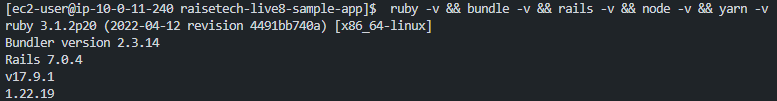
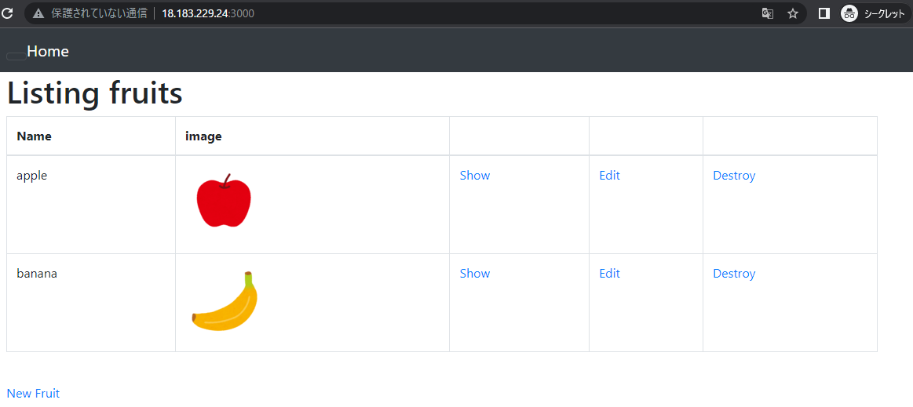
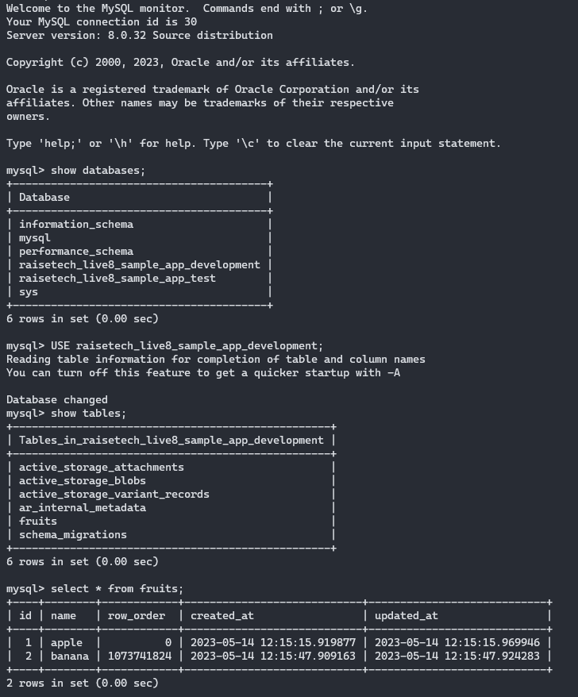
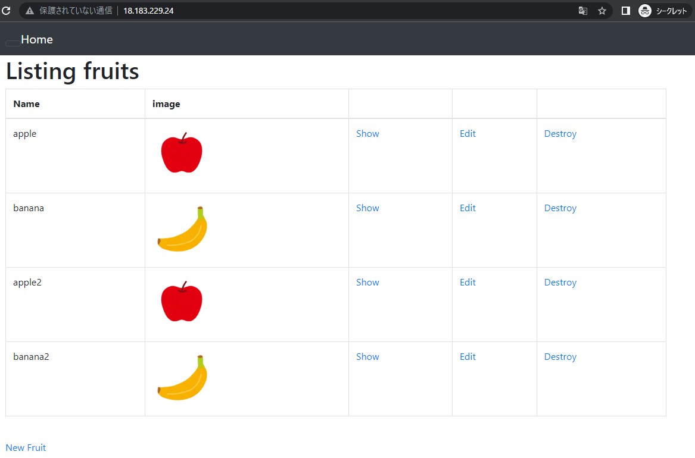
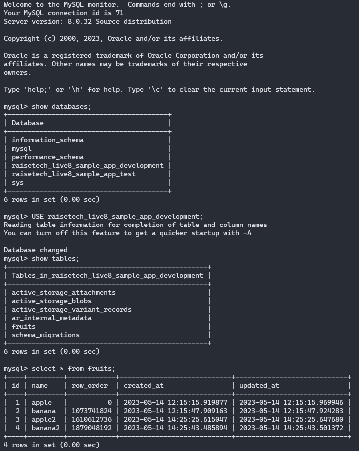
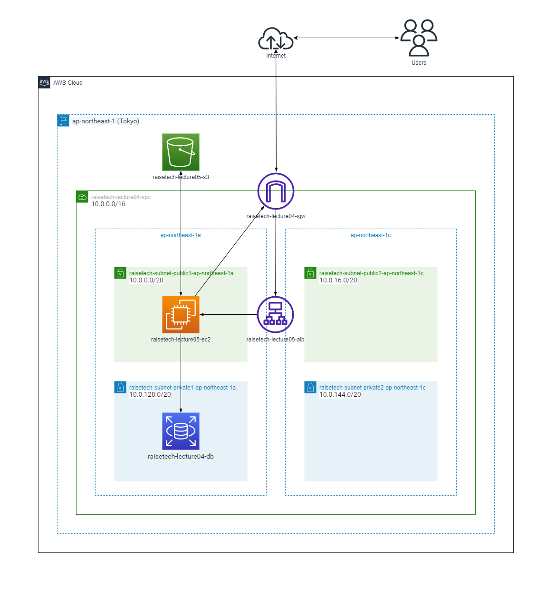

# 【 lecture05 】
 **- Ruby on Rails サンプルアプリケーションのデプロイ/ ELB(ALB) / S3 / 構成図 -**  

## ■ 課題内容 (目次)
1. [EC2上にサンプルアプリケーションをデプロイ・動作確認](#1-ec2上にサンプルアプリケーションをデプロイ動作確認) 
　1-1. [組み込みサーバー (Puma) のみでデプロイ・動作確認](#1-1-組み込みサーバー-Puma-のみでデプロイ動作確認) 
　1-2. [サーバアプリケーションを分けて (Nginx/Unicorn) デプロイ・動作確認](#1-2-サーバアプリケーションを分けて-nginxunicorn-デプロイ動作確認)
2. [ELB (ALB) を追加・動作確認](#2-elb-alb-を追加動作確認)
3. [S3 を追加・動作確認 ( S3 / Rails (Active Storage ) を連携)](#3-s3-を追加動作確認--s3--rails-active-storage--を連携)
4. [構成図作成　( 上記環境の構成図書き起こし )](#4-構成図作成-上記環境の構成図書き起こし-) 

　( ※今回使用するサンプルアプリケーションは第3回講義 (Lecture03) のものを使用) 
 
--- 

  
## 1. EC2上にサンプルアプリケーションをデプロイ・動作確認

### 1-1. 組み込みサーバー (Puma) のみでデプロイ・動作確認
- [EC2_eivironment_deploy.md](./building_procedure/EC2_eivironment_deploy.md) を元に環境構築、サンプルアプリケーションのデプロイ/起動を実施
- 起動後、ブラウザにて動作確認
- RDS( DB:MySQL )へ接続し、データ登録状況も確認 

\----------------------------------------------------------------------------------------------------------------------------------------- 
■ サンプルアプリケーションの動作環境確認 
| 動作環境 | バージョン | 
| -------- | ---------- |  
| Ruby     | 3.1.2      |  
| Bundler  | 2.3.14     |  
| Rails    | 7.0.4      |  
| Node     | v17.9.1    |  
| Yarn     | 1.22.19    | 

( 環境構築後、各種バージョン確認を実施 ) 
 

\----------------------------------------------------------------------------------------------------------------------------------------- 
■ ブラウザ動作確認 `ポート3000番` 
　( サンプルアプリケーション起動後、ブラウザにて接続確認 ( ※下図はブラウザよりデータ登録 (テキスト/画像) 後の画面 ) ) 
 

\----------------------------------------------------------------------------------------------------------------------------------------- 
■ RDS ( DB:MySQL ) のデータ登録確認 
  

--- 

### 1-2. サーバアプリケーションを分けて (Nginx/Unicorn) デプロイ・動作確認
- [Web-Nginx_AP-Unicorn.md](./building_procedure/Web-Nginx_AP-Unicorn.md) を元に、Webサーバ (Nginx) / APサーバ (Unicorn) に分けてサンプルアプリケーションのデプロイ/起動を実施
- 起動後、ブラウザにて動作確認
- RDS( DB:MySQL )へ接続し、データ登録状況も確認 

\----------------------------------------------------------------------------------------------------------------------------------------- 
■ ブラウザ動作確認 `ポート80番`  
　( サンプルアプリケーション起動後、ブラウザにて接続確認 ( ※下図はブラウザよりデータ登録 (テキスト/画像) 後の画面 ) ) 
 

\----------------------------------------------------------------------------------------------------------------------------------------- 
■ RDS ( DB:MySQL ) のデータ登録確認 
  

--- 

## 2. ELB (ALB) を追加・動作確認
- [ELB(ALB).md](./building_procedure/ELB(ALB).md) を元に ELB (ALB) の構築・設定、動作確認を実施
- 追加後、ブラウザにて動作確認
- RDS( DB:MySQL )へ接続し、データ登録状況も確認 

\----------------------------------------------------------------------------------------------------------------------------------------- 
■ ブラウザ動作確認 
　( ELB (ALB) の構築・設定 後、ブラウザにて接続確認 ( ※下図はブラウザよりデータ登録 (テキスト/画像) 後の画面 ) ) 
/browser_check2.png) 

\----------------------------------------------------------------------------------------------------------------------------------------- 
■ RDS ( DB:MySQL ) のデータ登録確認 
/rds_mysql_check.png)  

--- 

## 3. S3 を追加・動作確認 ( S3 / Rails (Active Storage ) を連携)
- [S3_Rails(ActiveStorage).md](./building_procedure/S3_Rails(ActiveStorage).md) を元に S3 / Rails(ActiveStorage) を連携、動作確認を実施
- 連携後、ブラウザにて動作確認
- RDS( DB:MySQL )へ接続し、データ登録状況も確認 

\----------------------------------------------------------------------------------------------------------------------------------------- 
■ ブラウザ動作確認 
　(  S3 / Rails(ActiveStorage) を連携後、ブラウザにて接続確認 ( ※下図はブラウザよりデータ登録 (テキスト/画像) 後の画面 ) ) 
/browser_check1.png) 

\----------------------------------------------------------------------------------------------------------------------------------------- 
■ S3バケットの画像保存確認 
/s3_save_check1.png)  

\----------------------------------------------------------------------------------------------------------------------------------------- 
■ RDS ( DB:MySQL ) のデータ登録確認 
/rds_mysql_check1.png)  

\----------------------------------------------------------------------------------------------------------------------------------------- 

【 既存データ更新の動作確認も実施 ( ※テーブル内最下段より2つ目 [apple-S3] を更新 ) 】

   
\----------------------------------------------------------------------------------------------------------------------------------------- 
■ ブラウザ動作確認 
/browser_check2.png) 
   
\----------------------------------------------------------------------------------------------------------------------------------------- 
■ S3バケットの画像保存確認 
/s3_save_check2.png)  

\----------------------------------------------------------------------------------------------------------------------------------------- 
■ RDS ( DB:MySQL ) のデータ登録確認 
/rds_mysql_check2.png) 
   

\----------------------------------------------------------------------------------------------------------------------------------------- 

  

--- 

## 4. 構成図作成　( 上記環境の構成図書き起こし )

